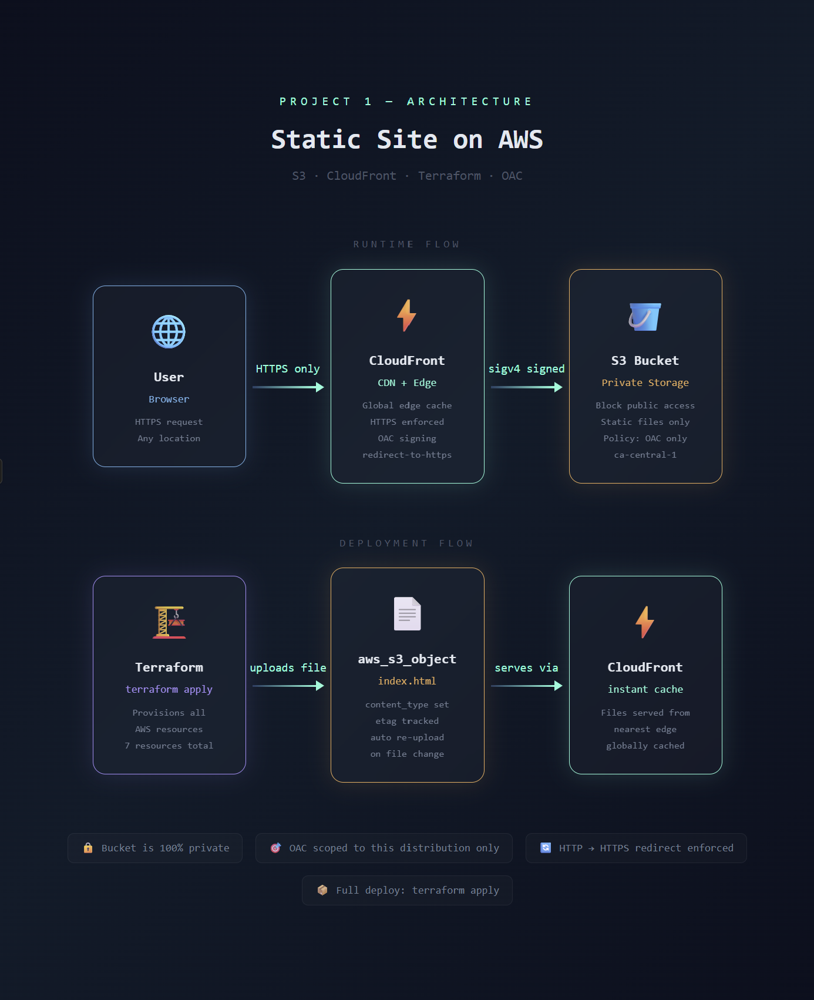

# AWS Static Site — S3 + CloudFront + Terraform

> **Live Site:** [https://deol6jveroi4a.cloudfront.net](https://deol6jveroi4a.cloudfront.net)

A secure static website on AWS, fully provisioned with Terraform. No manual steps — `terraform apply` deploys both infrastructure and content in one command.



---

## Stack

| | |
|---|---|
| **Storage** | AWS S3 (private bucket) |
| **CDN** | AWS CloudFront |
| **IaC** | Terraform |
| **Region** | ca-central-1 |

---

## Security

- S3 bucket has all public access blocked — no direct URL access
- CloudFront connects via **OAC** (Origin Access Control) using sigv4 signing
- Bucket policy scoped to this specific CloudFront distribution ARN only
- All HTTP traffic automatically redirected to HTTPS

---

## Resources Provisioned

| Resource | Purpose |
|---|---|
| `aws_s3_bucket` | Private static file storage |
| `aws_s3_bucket_public_access_block` | Blocks all public access |
| `aws_s3_bucket_website_configuration` | Enables static hosting |
| `aws_cloudfront_origin_access_control` | Secure CloudFront → S3 identity |
| `aws_cloudfront_distribution` | Global CDN distribution |
| `aws_s3_bucket_policy` | Grants CloudFront-only read access |
| `aws_s3_object` | Deploys website file via Terraform |

---

## Deploy It Yourself

```bash
git clone https://github.com/dhruvs-git/aws-static-site-s3-cloudfront
cd aws-static-site-s3-cloudfront
cp terraform.tfvars.example terraform.tfvars
# fill in your bucket name and region
terraform init
terraform apply
```

---

## Key Decisions

**Private S3 + OAC over public bucket** — Users can only reach content through CloudFront. Direct S3 access is blocked entirely, preventing security bypass.

**`templatefile()` for bucket policy** — Bucket and CloudFront ARNs are injected dynamically at runtime. No hardcoded values anywhere.

**`aws_s3_object` instead of CLI upload** — File is managed by Terraform. If content changes, etag detection triggers automatic re-upload on next apply.


---

**Dhruv Barot** · [LinkedIn](https://www.linkedin.com/in/dhruv-barot-bb71a3268/) · [GitHub](https://github.com/dhruvs-git)
